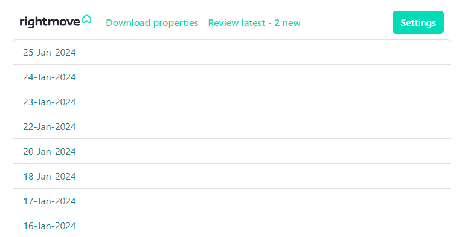

# Rightmove Alerts



## Description

This project wraps the hidden Rightmove API, implemented in their website to populate their map search page, as well as
the data displayed to the user on the website.
Fundamentally the tool is built to obtain results from the API, and automatically email the user with properties
that meet their requirements.

## Property data

- **Core data:** Obtain all properties from the Rightmove API within a given search area, in both Rent and Buy channels
  as required
- **Travel Time:** Compare the location to travel time JSON files, to determine whether the property is within the
  requirements
- **Excluded area:** Compare the location to an 'excluded area' JSON file, to remove properties that are not in a
  desired location
- **Floorplan:** Downloads the floorplan from the Rightmove page and extracts the sqft area where it is missing from the
  data
- **OpenAI:** Reviews the summary/description from the Rightmove page and detirmines whether the property has a private
  garden

## Interface

- Flask web interface allows the user to go through the daily "reviews" of new properties, and see the properties on a
  map.
- From the review page, you can manually send an email.
- Force a refresh and download new properties/data.

## Installation

Project currently relies on a locally hosted PostGreSQL database, this URI is held in the `DATABASE_URI` variable
in the config, so you can create a new database, update the URI to point to it, and run the views.sql file to create the
schema.

### Windows

```cmd
git clone https://github.com/a-j-jones/rightmove_alert.git
cd rightmove_alert
pip install -r requirements.txt
```

### Docker

```cmd
git clone https://github.com/a-j-jones/rightmove_alert.git
cd rightmove_alert
docker-compose up --build
```

## Usage

Navigate to the locally hosted webpage, by default this is http://localhost:5009

- Download new properties with "Download properties"
- View latest, non-reviewed properties with "Review properties"
    - When reviewing properties, you may click "Mark reviewed" to set the unreviewed properties to reviewed.
- View any day of reviewed properties in the list.
    - When reviewing the selected day, you may click "Send email" to send the properties to the user.
- Settings, update the email address for the recipients.
